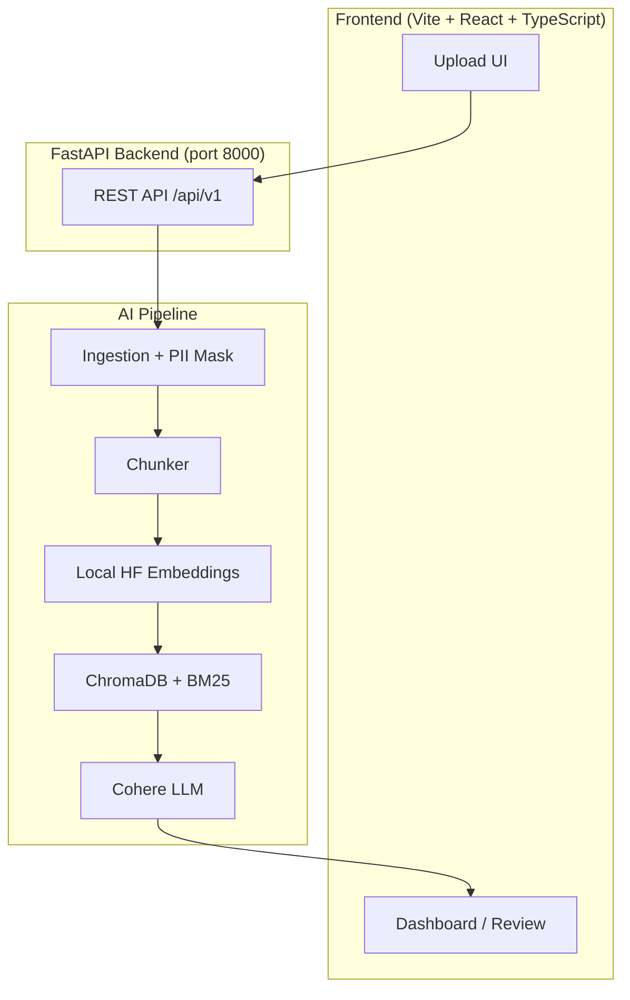

# MediSync

**AI Shift-Handoff & Discharge Copilot**

MediSync is an AI-powered web application that transforms unstructured patient data (scanned notes, PDFs, lab reports, CSV/JSON) into formatted **Discharge Summaries** and **Shift-Handoff Notes** with clickable, source-attributed citations. It uses a hybrid RAG pipeline: local GPU embeddings + ChromaDB/BM25 retrieval, with a Cohere LLM for structured generation.

> ⚠️ **Status:** Prototype / hackathon build. Not for real clinical use. PII anonymization, persistent storage, and the API generation path are partially stubbed — see *Implementation Status* below and the per-component READMEs.

---

## Architecture



- **Backend:** FastAPI + Uvicorn, Python.
- **AI/RAG:** LangChain, HuggingFace `all-MiniLM-L6-v2` embeddings (CUDA/CPU), ChromaDB vector store, `rank-bm25` keyword index, Cohere `command-r` generation.
- **Frontend:** Vite + React + TypeScript, Tailwind CSS + shadcn/ui, Zustand state, React Router, TanStack Query, Recharts.

---

## Repository Structure

```
MediSync/
├── backend/            # FastAPI backend (see backend/README.md)
├── frontend/           # Vite + React SPA (see frontend/README.md)
├── tests/              # Sample clinical fixtures (john_doe_*.txt)
├── plans/              # Design docs, project report, UI plan
├── requirements.txt    # Python backend dependencies
├── package-lock.json   # Frontend dependency lockfile
├── .env.example        # Backend environment template
└── MediSync.pdf        # Project brief
```

---

## Prerequisites

| Tool | Version |
|------|---------|
| Python | 3.10+ |
| Node.js | 18+ |
| pip | latest |
| (Optional) CUDA GPU | for local embeddings acceleration |

---

## Quick Start (Local Development)

### 1. Backend

```bash
cd backend
python -m venv .venv
source .venv/bin/activate          # Windows: .venv\Scripts\activate
pip install -r ../requirements.txt
cp ../.env.example ../.env          # then fill in COHERE_API_KEY
uvicorn main:app --reload --port 8000
```

API docs: http://localhost:8000/api/docs

### 2. Frontend

```bash
cd frontend
npm install
npm run dev
```

App: http://localhost:5173 (proxies to backend at `http://localhost:8000/api/v1`)

See [`backend/README.md`](backend/README.md) and [`frontend/README.md`](frontend/README.md) for full details.

---

## Configuration

All backend settings live in `.env` (template: `.env.example`). Key variables:

- `COHERE_API_KEY` — **required** for real generation.
- `COHERE_MODEL` — `command-r` (default) or `command-r7b-12-2024`.
- `EMBEDDING_DEVICE` — `cuda` (GPU) or `cpu`.
- `CHUNK_SIZE`, `CHUNK_OVERLAP`, `DATA_DIR`, `CHROMA_PERSIST_DIRECTORY`.

---

## Documentation

- `plans/plan.md` — architecture, phases, risk mitigation, timeline.
- `plans/medisync_project_report.md` — implementation report.
- `plans/ui_plan.md` — frontend dashboard specification.
- In-app API reference: `/api/docs`, `/api/redoc`.

---

## Implementation Status

| Area | State |
|------|-------|
| FastAPI endpoints (documents/upload/summary/health) | ✅ Working (in-memory storage) |
| Standalone RAG pipeline (`services/rag_pipeline.py`) | ✅ Functional demo |
| API → RAG wiring (`services/rag.py`, `generation.py`) | ⚠️ Stubs / mock LLM (not yet connected) |
| PII anonymization (Presidio) | ⚠️ Stub — returns text unchanged |
| PDF / image (OCR) extraction | ⚠️ Stub |
| Persistent database | ❌ In-memory only (lost on restart) |
| Celery/Redis task queue, Ragas eval, ABDM/SNOMED | 📋 Planned |

---

## License & Disclaimer

Demo project for the NEXUS AESCODE MedTech Hackathon. Not a medical device. Do not use with real patient data without proper compliance (HIPAA/ABDM) controls.
