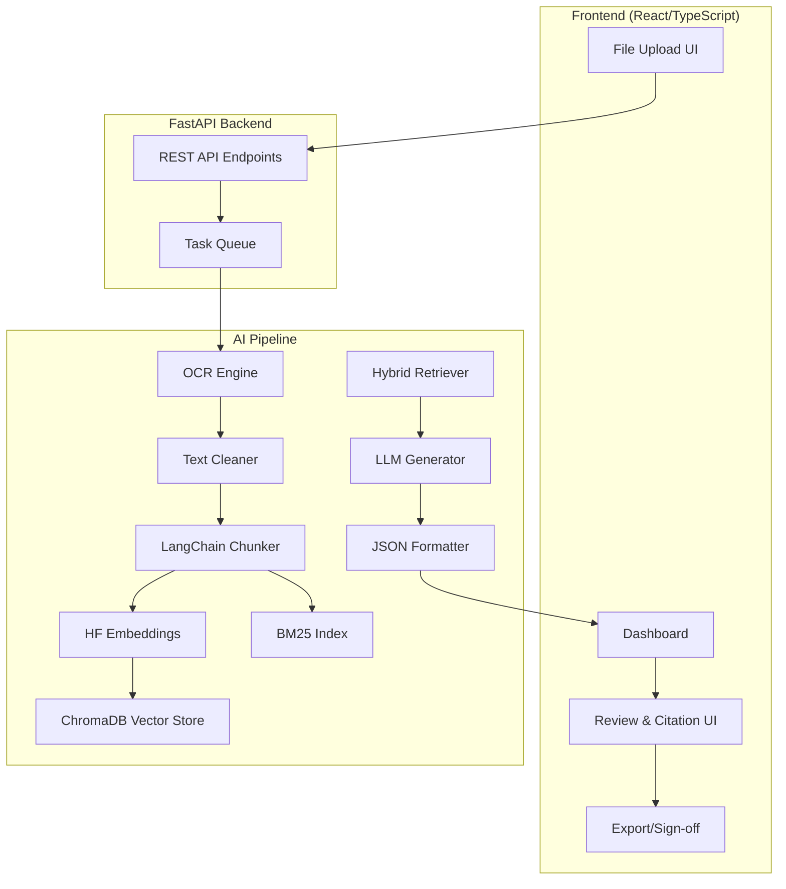
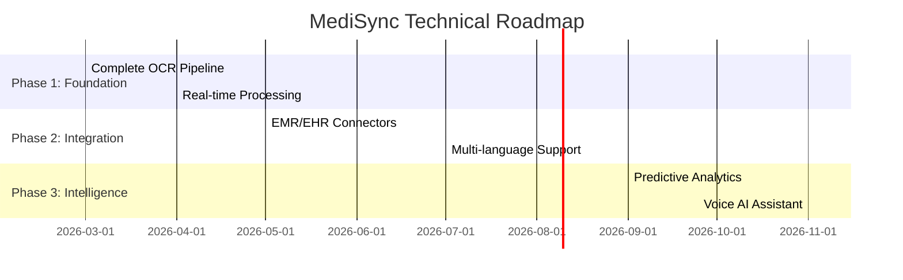

# MediSync: AI Shift-Handoff & Discharge Copilot

## Detailed Project Report

---

## 1. Problem Statement

### 1.1 The Healthcare Administrative Crisis

Healthcare professionals face a critical challenge: they spend **40-60% of their time** on administrative tasks rather than direct patient care. This administrative burden is particularly acute in two critical workflows that directly impact patient safety and quality of care.

### 1.2 Critical Pain Points

#### 1.2.1 Shift Handoffs
- When nurses or doctors change shifts, they must communicate patient status, medications, and pending tasks
- **70% of preventable medical errors** are attributed to poor handoff communications
- Information is often incomplete, inconsistent, or lost during transitions
- Manual transcription leads to missed critical details

#### 1.2.2 Discharge Summaries
- Writing comprehensive discharge documentation takes **30-60 minutes per patient**
- Summaries are frequently delayed, affecting care continuity
- Missing critical information leads to hospital readmissions
- Poor documentation impacts reimbursement and legal records

#### 1.2.3 Core Challenges
| Challenge | Impact |
|-----------|--------|
| **Information Overload** | Doctors receive 50+ files per patient (lab reports, imaging, handwritten notes, nursing assessments) |
| **Unstructured Data** | Scanned documents, handwritten notes, and mixed-format PDFs are difficult to parse |
| **Time Poverty** | Administrative work cuts into patient interaction time |
| **Error Risk** | Manual transcription leads to missed allergies, medications, or follow-up instructions |

### 1.3 The Need for Transformation

Healthcare facilities need an intelligent solution that can:
- Automatically process diverse document formats
- Extract and organize critical patient information
- Generate accurate, structured clinical documentation
- Provide source attribution for all generated content
- Reduce administrative time while improving accuracy

---

## 2. Proposed Solution

### 2.1 MediSync Overview

**MediSync** is an AI-powered web application that eliminates clinical administrative burnout by transforming messy, unstructured patient data into perfectly formatted **Discharge Summaries** and **Shift-Handoff Notes** in seconds.

### 2.2 Solution Architecture

Using advanced OCR (Optical Character Recognition) and **Retrieval-Augmented Generation (RAG)** technology, MediSync enables doctors to:

1. **Upload folders** of scanned handwritten notes, PDFs, and lab reports
2. **Receive AI-generated documentation** with **clickable citations** linking every claim back to the original source document
3. **Review, edit, and sign off** on final documentation

### 2.3 Core Capabilities

| Capability | Description |
|------------|-------------|
| **Automated Ingestion** | Drag-and-drop upload of 50+ mixed-format files (PDFs, images, scans) |
| **Intelligent Processing** | OCR extracts text from handwritten notes and images; LangChain chunks and embeds content |
| **Hybrid Search** | Combines vector similarity with BM25 keyword search to ensure zero dropped data |
| **Structured Generation** | LLM produces JSON-structured summaries with mandatory fields (Diagnosis, Medications, Allergies, Follow-up, Vitals) |
| **Attribution UI** | Every AI-generated claim includes clickable citations linking to the exact source document and page |
| **Human-in-the-Loop** | Doctor reviews, edits, and signs off on final documentation |

### 2.4 Key Differentiators

- **Clickable Citations**: Every AI-generated claim links back to source documents
- **Hybrid RAG Pipeline**: Combines vector search with keyword search for maximum accuracy
- **Structured JSON Output**: Machine-readable clinical data with standardized schema
- **Privacy-First Design**: PII anonymization before any external API calls
- **Hospital-Grade UI**: Professional dashboard with medical styling

---

## 3. Implementation

### 3.1 System Architecture



### 3.2 Implementation Phases

#### Phase 1: Ingestion Pipeline

**Goal**: Convert messy, multi-format patient documents into clean, structured text

| Component | Technology | Purpose |
|-----------|------------|---------|
| File Router | FastAPI | Detect file type, route to appropriate processor |
| Data Loaders | LangChain | Load CSV, JSON, PDF, text files |
| Text Cleaner | Regex + spaCy | Remove noise, normalize formatting |
| Metadata Tagger | Custom | Add source filename, page number, date |
| PII Shield | Microsoft Presidio | Anonymize patient names, DOBs, IDs |

**Deliverables**:
- [x] CSV/JSON data loader for curated dataset
- [x] File upload endpoint for PDF, PNG, JPG, TIFF
- [x] Text cleaning and normalization
- [x] Metadata extraction (dates, patient IDs)

#### Phase 2: Memory & Retrieval Pipeline

**Goal**: Transform clean text into searchable, chunked embeddings stored in ChromaDB

| Component | Technology | Purpose |
|-----------|------------|---------|
| Text Chunker | LangChain | Split documents into semantic chunks (512-1024 tokens) |
| Embedding Model | HuggingFace all-MiniLM-L6-v2 | Generate dense vector representations |
| Vector Store | ChromaDB | Local persistent storage for embeddings |
| BM25 Index | rank_bm25 | Keyword-based search for exact matches |
| Hybrid Retriever | LangChain | Combine vector + BM25 using reciprocal rank fusion |

**Chunking Strategy**:
- **Recursive Character Split**: Split on newlines, sentences, paragraphs
- **Chunk Size**: 512-1024 tokens with 20% overlap
- **Metadata**: Preserve source document, page number, chunk index

#### Phase 3: Generation & Copilot UI

**Goal**: Generate structured clinical summaries with full source attribution

**LLM-Native Citation Strategy**: The system prompt forces the LLM to include `[Chunk_ID]` tags. The frontend parses these tags and creates clickable links to source documents.

**JSON Output Schema**:

```json
{
  "patient_summary": {
    "chief_complaint": "string",
    "diagnosis": ["string"],
    "medications": [
      {
        "name": "string",
        "dosage": "string",
        "frequency": "string",
        "route": "string"
      }
    ],
    "allergies": ["string"],
    "vitals": {
      "blood_pressure": "string",
      "heart_rate": "string",
      "temperature": "string",
      "respiratory_rate": "string"
    },
    "procedures_performed": ["string"],
    "follow_up_instructions": "string",
    "discharge_disposition": "string"
  },
  "citations": [
    {
      "claim": "string",
      "source_document": "string",
      "page_number": "number",
      "chunk_id": "string",
      "relevance_score": "number"
    }
  ]
}
```

### 3.3 Backend Implementation Details

#### API Endpoints

| Endpoint | Method | Description |
|----------|--------|-------------|
| `/api/v1/health` | GET | Health check endpoint |
| `/api/v1/documents` | GET, POST | List and create documents |
| `/api/v1/documents/{id}` | GET, DELETE | Get or delete specific document |
| `/api/v1/upload` | POST | Upload files for processing |
| `/api/v1/summary` | POST | Generate clinical summary |

#### Core Services

| Service | File | Purpose |
|---------|------|---------|
| **Ingestion** | [`backend/services/ingestion.py`](backend/services/ingestion.py) | File processing, text extraction, PII anonymization, chunking |
| **RAG Pipeline** | [`backend/services/rag_pipeline.py`](backend/services/rag_pipeline.py) | Hybrid search, document retrieval, citation generation |
| **Generation** | [`backend/services/generation.py`](backend/services/generation.py) | LLM integration, JSON formatting, clinical summary generation |

### 3.4 Frontend Implementation Details

#### Pages & Features

| Page | File | Features |
|------|------|----------|
| **Dashboard** | [`frontend/src/pages/Dashboard.tsx`](frontend/src/pages/Dashboard.tsx) | Patient overview, vitals display, timeline, summary preview |
| **Upload** | [`frontend/src/pages/Upload.tsx`](frontend/src/pages/Upload.tsx) | Drag-and-drop file upload, progress tracking, file management |
| **Documents** | [`frontend/src/pages/Documents.tsx`](frontend/src/pages/Documents.tsx) | Document listing, search, filtering |
| **Summaries** | [`frontend/src/pages/Summaries.tsx`](frontend/src/pages/Summaries.tsx) | Generated summaries, citations, editing |
| **Settings** | [`frontend/src/pages/Settings.tsx`](frontend/src/pages/Settings.tsx) | Configuration, API keys |

#### Data Types

| Type | Definition |
|------|------------|
| **Document** | Uploaded file with extracted content, chunks, and metadata |
| **Summary** | Generated clinical documentation with citations |
| **Chunk** | Semantically split document segment with embedding |
| **Citation** | Source reference linking claims to documents |

---

## 4. Tech Stack Used

### 4.1 Frontend Technology Stack

| Component | Technology | Version | Purpose |
|-----------|------------|---------|---------|
| Framework | React + Vite | 18+ | Production-grade UI framework |
| Language | TypeScript | 5+ | Type-safe development |
| UI Library | Tailwind CSS + shadcn/ui | Latest | Hospital dashboard aesthetic |
| State Management | Zustand | Latest | Lightweight state for upload/progress |
| Routing | React Router | v6 | Page navigation |
| Forms | Zod + React Hook Form | Latest | Form validation |
| Data Fetching | TanStack Query | Latest | Server state management |
| Icons | Lucide React | Latest | Medical-themed icons |
| Charts | Recharts | Latest | Vitals visualization |

### 4.2 Backend Technology Stack

| Component | Technology | Purpose |
|-----------|------------|---------|
| API Framework | FastAPI | High-performance async REST API |
| Server | Uvicorn | ASGI server |
| Validation | Pydantic | Request/response validation |
| CORS | fastapi-cors | Cross-origin requests |
| Task Queue | Celery + Redis | Background processing (planned) |

### 4.3 AI & RAG Pipeline

| Component | Technology | Purpose |
|-----------|------------|---------|
| LLM | **Cohere Command-R7B** | Primary: Enterprise-grade generation |
| Framework | LangChain | Orchestrate RAG pipeline |
| Embeddings | HuggingFace all-MiniLM-L6-v2 | Dense vector representations |
| Vector Store | ChromaDB | Local persistent vector database |
| Keyword Search | rank_bm25 | BM25 for hybrid search |
| PII Anonymizer | Microsoft Presidio | Auto-mask PII before API calls |

### 4.4 Data Processing

| Component | Technology | Purpose |
|-----------|------------|---------|
| File Processing | pypdf, python-docx | PDF and Word document handling |
| Image Processing | Pillow (PIL) | Image enhancement |
| Text Processing | spaCy + Regex | NER, normalization |
| Data Processing | pandas, numpy | Data manipulation |

### 4.5 Development & Deployment

| Component | Technology |
|-----------|------------|
| Environment | Python 3.10+, Node.js 18+ |
| Package Manager | pip, npm |
| Virtual Environment | .venv |
| API Testing | FastAPI built-in docs |

---

## 5. Impact

### 5.1 Clinical Impact

| Impact Area | Expected Improvement |
|-------------|---------------------|
| **Time Savings** | Reduce documentation time from 30-60 min to under 5 min per patient |
| **Error Reduction** | Eliminate missed allergies, medications through automated extraction |
| **Care Continuity** | Enable faster, more accurate handoffs between shifts |
| **Readmission Reduction** | Improve discharge summary quality to reduce preventable readmissions |

### 5.2 Healthcare Provider Impact

| Stakeholder | Benefit |
|-------------|---------|
| **Doctors** | Spend less time on paperwork, more time on patient care |
| **Nurses** | Accurate handoff notes reduce errors and shift transition stress |
| **Hospital Administrators** | Better documentation improves reimbursement and compliance |
| **Patients** | Clearer discharge instructions improve recovery and follow-up adherence |

### 5.3 Operational Impact

- **Workflow Efficiency**: Automated document processing replaces manual data entry
- **Cost Reduction**: Lower administrative overhead per patient
- **Compliance**: Structured output supports regulatory requirements
- **Integration Ready**: JSON output can integrate with EMR/EHR systems

### 5.4 Key Features for Impact

1. **Clickable Citations**: Build trust through transparency - doctors can verify every AI-generated claim
2. **Human-in-the-Loop**: Final review ensures accuracy before signing
3. **Dual Output**: Supports both Discharge Summaries and Shift Handoff Notes
4. **Privacy First**: PII anonymization protects patient data before external processing

---

## 6. Future Scope

### 6.1 Short-Term Enhancements (3-6 months)

| Feature | Description |
|---------|-------------|
| **OCR Integration** | Full implementation of GPT-4o Vision / Claude Vision for handwriting recognition |
| **Real-time Collaboration** | Multiple users editing documents simultaneously |
| **EMR Integration** | Connect with existing Electronic Medical Record systems |
| **Voice Input** | Dictation support for hands-free documentation |

### 6.2 Medium-Term Enhancements (6-12 months)

| Feature | Description |
|---------|-------------|
| **Multi-language Support** | Generate summaries in multiple languages |
| **Specialty Templates** | Cardiology, Pediatrics, Surgery-specific formats |
| **Quality Metrics** | Track documentation accuracy and completeness scores |
| **Audit Logging** | Complete trail of who viewed/edits/signed documents |

### 6.3 Long-Term Vision (1-2 years)

| Feature | Description |
|---------|-------------|
| **ABDM Integration** | Connect with India's Ayushman Bharat Digital Mission |
| **SNOMED CT Codes** | Auto-code diagnoses using standardized medical terminologies |
| **Predictive Analytics** | Identify at-risk patients from documentation patterns |
| **Telehealth Integration** | Embedded within telemedicine platforms |
| **Voice AI Assistant** | Real-time clinical documentation during patient encounters |

### 6.4 Technical Roadmap



### 6.5 Scalability Considerations

- **Cloud Deployment**: Move from local ChromaDB to cloud vector databases
- **Multi-tenant Architecture**: Support multiple hospitals/clinics
- **Horizontal Scaling**: Containerize services for Kubernetes deployment
- **Caching Layer**: Redis caching for frequent queries
- **Load Balancing**: Distribute API requests across instances

### 6.6 Compliance & Security

- **HIPAA Compliance**: Ensure all PHI handling meets US healthcare standards
- **GDPR Ready**: Support European data protection requirements
- **ISO 27001**: Implement information security management
- **Audit Trails**: Complete logging of all data access

---

## 7. Conclusion

MediSync represents a significant step forward in healthcare documentation automation. By combining cutting-edge AI technologies (RAG, LLMs, embeddings) with a user-friendly interface, the platform addresses the critical administrative burden facing healthcare providers.

The project's hybrid architecture balances cost-effectiveness (local GPU embeddings) with enterprise-grade capabilities (Cohere LLM), making it accessible for healthcare facilities of various sizes.

With the foundation now in place, MediSync is well-positioned to expand into a comprehensive clinical documentation platform that can integrate with existing healthcare infrastructure and evolve with the advancing AI landscape.

---

**Report Generated**: February 2026  
**Project Version**: 1.0.0  
**Documentation Status**: Complete
