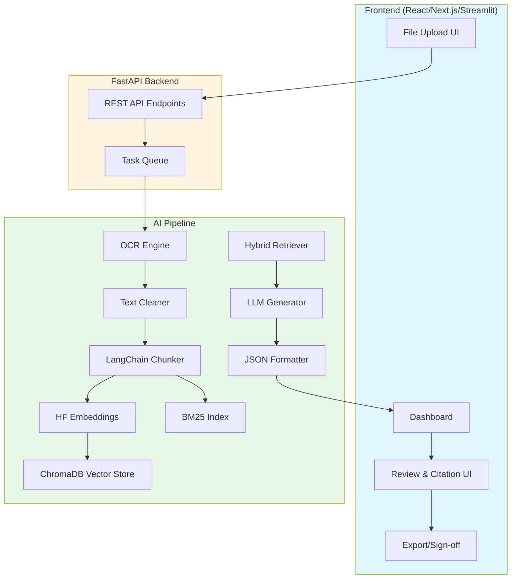
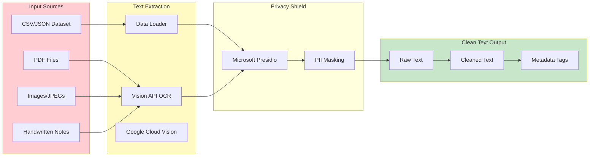
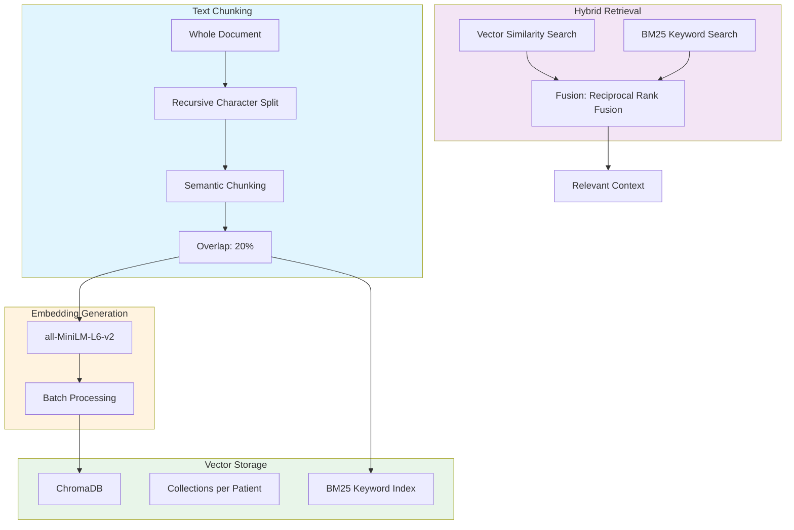
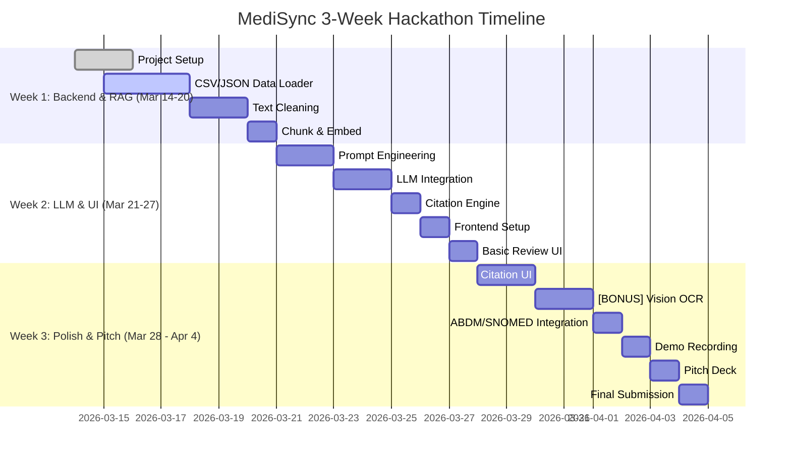

# MediSync: AI Shift-Handoff & Discharge Copilot

## Project Overview & Elevator Pitch

### Project Title
**MediSync** — The AI Shift-Handoff & Discharge Copilot

### Elevator Pitch
MediSync is an AI-powered web application that eliminates clinical administrative burnout by transforming messy, unstructured patient data into perfectly formatted Discharge Summaries and Shift-Handoff Notes in seconds. Using advanced OCR and Retrieval-Augmented Generation (RAG), doctors can upload folders of scanned handwritten notes, PDFs, and lab reports, and receive AI-generated documentation with **clickable citations** linking every claim back to the original source document. No more copy-pasting. No more missed details. Just accurate, attributable clinical documentation.

---

## The Clinical Problem & Our Solution

### The Clinical Problem

Healthcare professionals spend **40-60% of their time** on administrative tasks rather than patient care. The burden is particularly acute in two critical workflows:

1. **Shift Handoffs**: When nurses or doctors change shifts, they must communicate patient status, medications, and pending tasks. Poor handoffs contribute to **70% of preventable medical errors**.

2. **Discharge Summaries**: Writing comprehensive discharge documentation is time-consuming (30-60 minutes per patient), often delayed, and frequently missing critical information—leading to readmissions and poor care continuity.

The core pain points include:
- **Information Overload**: Doctors receive 50+ files per patient (lab reports, imaging, handwritten notes, nursing assessments)
- **Unstructured Data**: Scanned documents, handwritten notes, and mixed-format PDFs are difficult to parse
- **Time Poverty**: Administrative work cuts into patient interaction time
- **Error Risk**: Manual transcription leads to missed allergies, medications, or follow-up instructions

### Our Solution

MediSync addresses these challenges through an end-to-end AI pipeline:

1. **Automated Ingestion**: Drag-and-drop upload of 50+ mixed-format files (PDFs, images, scans)
2. **Intelligent Processing**: OCR extracts text from handwritten notes and images; LangChain chunks and embeds content
3. **Hybrid Search**: Combines vector similarity with BM25 keyword search to ensure zero dropped data
4. **Structured Generation**: LLM produces JSON-structured summaries with mandatory fields (Diagnosis, Medications, Allergies, Follow-up, Vitals)
5. **Attribution UI**: Every AI-generated claim includes clickable citations linking to the exact source document and page
6. **Human-in-the-Loop**: Doctor reviews, edits, and signs off on final documentation

---

## System Architecture & Data Flow

### High-Level Architecture



---

### Phase 1: Ingestion Pipeline

**Goal**: Convert messy, multi-format patient documents into clean, structured text

> **Modular Design**: This phase supports both (1) **CSV/JSON data loaders** for the hackathon's curated dataset, and (2) **OCR file upload** as a bonus real-world feature for legacy hospital paperwork.



**Key Components**:

| Component | Technology | Purpose |
|-----------|------------|---------|
| File Router | FastAPI | Detect file type, route to appropriate OCR |
| Pytesseract | Tesseract OCR | Open-source OCR for printed text |
| Google Cloud Vision | GCP API | Advanced OCR, handwriting recognition |
| Text Cleaner | Regex + spaCy | Remove noise, normalize formatting |
| Metadata Tagger | Custom | Add source filename, page number, date |

**Phase 1 Deliverables**:
- [ ] CSV/JSON data loader for curated dataset (primary for hackathon)
- [ ] File upload endpoint for PDF, PNG, JPG, TIFF (bonus feature)
- [ ] Vision API integration for handwriting extraction (GPT-4o Vision / Claude Vision)
- [ ] Microsoft Presidio PII anonymizer (patient names, DOBs, IDs)
- [ ] Text cleaning and normalization
- [ ] Metadata extraction (dates, patient IDs if present)

---

### Phase 2: Memory & Retrieval Pipeline

**Goal**: Transform clean text into searchable, chunked embeddings stored in ChromaDB



**Key Components**:

| Component | Technology | Purpose |
|-----------|------------|---------|
| Text Chunker | LangChain | Split documents into semantic chunks (512-1024 tokens) |
| Embedding Model | HuggingFace all-MiniLM-L6-v2 | Generate dense vector representations |
| Vector Store | ChromaDB | Local persistent storage for embeddings |
| BM25 Index | rank_bm25 | Keyword-based search for exact matches |
| Hybrid Retriever | LangChain | Combine vector + BM25 using reciprocal rank fusion |

**Chunking Strategy**:
- **Recursive Character Split**: Split on newlines, sentences, paragraphs
- **Chunk Size**: 512-1024 tokens with 20% overlap
- **Metadata**: Preserve source document, page number, chunk index

**Phase 2 Deliverables**:
- [ ] LangChain document loader for cleaned text
- [ ] Chunking pipeline with overlap
- [ ] HuggingFace embedding generation
- [ ] ChromaDB setup with per-patient collections
- [ ] BM25 keyword index alongside vector store
- [ ] Hybrid retriever combining both search methods

---

### Phase 3: Generation & Copilot UI

**Goal**: Generate structured clinical summaries with full source attribution

> **LLM-Native Citation Strategy**: Instead of building a complex custom matcher, the system prompt forces the LLM to include `[Chunk_ID]` tags. The frontend simply parses these tags and creates clickable links.

```mermaid
flowchart TB
    subgraph Prompt["Prompt Engineering"]
        TEMPLATE[System Prompt with Citation Rule]
        RULE["For each claim: Include [Chunk_ID] from context"]
        JSON_SCHEMA[JSON Schema: Diagnosis, Meds, Allergies, Follow-up, Vitals]
    end

    subgraph Generation["LLM Generation"]
        CONTEXT[Retrieved Context with Chunk_IDs]
        TEMP[System + User Prompt]
        LLM[GPT-4o / Claude 3.5 / Llama-3]
        OUTPUT[JSON Output with [Chunk_ID] tags]
    end

    subgraph UI["Attribution UI"]
        PARSE[Parse [Chunk_ID] from output]
        LINK[Create clickable hyperlinks]
        DASH[Dashboard Display]
        CLICK[Click to view source chunk]
        EDIT[Doctor Edits]
        SIGN[Sign-off Button]
    end

    TEMPLATE --> RULE
    JSON_SCHEMA --> TEMP
    RULE --> TEMP
    CONTEXT --> TEMP
    TEMP --> LLM
    LLM --> OUTPUT
    OUTPUT --> PARSE
    PARSE --> LINK
    LINK --> DASH
    DASH --> CLICK
    CLICK --> EDIT
    EDIT --> SIGN

    style Prompt fill:#fff9c4
    style Generation fill:#e1f5fe
    style UI fill:#e8f5e9
```

**Key Components**:

| Component | Technology | Purpose |
|-----------|------------|---------|
| System Prompt | Custom | Force JSON output with strict schema + `[Chunk_ID]` tags |
| JSON Schema | Pydantic | Define required fields for clinical notes |
| LLM | GPT-4o / Claude 3.5 / Llama-3 | Generate context-aware summaries |
| Citation Matcher | **LLM-Native Prompting** | Force LLM to append `[Chunk_ID]` to each claim |
| Review UI | React/Streamlit | Interactive editing and verification |

**JSON Output Schema**:

```json
{
  "patient_summary": {
    "chief_complaint": "string",
    "diagnosis": ["string"],
    "medications": [
      {
        "name": "string",
        "dosage": "string",
        "frequency": "string",
        "route": "string"
      }
    ],
    "allergies": ["string"],
    "vitals": {
      "blood_pressure": "string",
      "heart_rate": "string",
      "temperature": "string",
      "respiratory_rate": "string"
    },
    "procedures_performed": ["string"],
    "follow_up_instructions": "string",
    "discharge_disposition": "string"
  },
  "citations": [
    {
      "claim": "string",
      "source_document": "string",
      "page_number": "number",
      "chunk_id": "string",
      "relevance_score": "number"
    }
  ]
}
```

**Phase 3 Deliverables**:
- [ ] System prompt with JSON schema enforcement
- [ ] LLM integration (primary: GPT-4o, fallback: Claude 3.5)
- [ ] Citation linking engine
- [ ] React/Next.js review dashboard
- [ ] Highlight-and-cite UI component
- [ ] Edit and sign-off workflow

---

## Tech Stack Requirements

### Frontend

| Component | Technology | Version | Purpose |
|-----------|------------|---------|---------|
| Framework | React + Next.js | 14+ | Production-grade UI framework |
| UI Library | Tailwind CSS + shadcn/ui | Latest | Sleek hospital dashboard aesthetic |
| State Management | Zustand | Latest | Lightweight state for upload/progress |
| File Handling | react-dropzone | Latest | Drag-and-drop file upload |
| PDF Viewer | react-pdf | Latest | Display source documents inline |
| Markdown/JSON Viewer | react-json-view | Latest | Display structured output |

**Alternative**: Streamlit (faster prototyping, built-in data visualization)

### Backend

| Component | Technology | Purpose |
|-----------|------------|---------|
| API Framework | FastAPI | High-performance async REST API |
| Task Queue | Celery + Redis | Background OCR and embedding tasks |
| Server | Uvicorn | ASGI server |
| CORS | fastapi-cors | Cross-origin requests |
| Validation | Pydantic | Request/response validation |
| **PII Shield** | **Microsoft Presidio** | Anonymize PII before sending to external APIs |

### AI & RAG Pipeline

| Component | Technology | Purpose |
|-----------|------------|---------|
| LLM | **GPT-4o (via Azure OpenAI)** | Primary: HIPAA-compliant, enterprise-grade |
| LLM (Alt) | Claude 3.5 Sonnet | Fallback: Strong medical reasoning |
| LLM (Local) | Llama-3 70B | Offline fallback if API unavailable |
| PII Anonymizer | **Microsoft Presidio** | Auto-mask PII before API calls |
| Framework | LangChain | Orchestrate RAG pipeline |
| Framework (Alt) | LlamaIndex | Alternative for document indexing |
| Embeddings | HuggingFace all-MiniLM-L6-v2 | Dense vector representations |
| Vector Store | ChromaDB | Local persistent vector database |
| Keyword Search | rank_bm25 | BM25 for hybrid search |
| **Evaluation** | **Ragas (RAG Assessment)** | Programmatic evaluation of context precision and answer relevancy |

### OCR Pipeline

| Component | Technology | Purpose |
|-----------|------------|---------|
| Primary OCR | **GPT-4o Vision API** | Multimodal LLM for handwriting extraction |
| Primary OCR (Alt) | **Claude 3.5 Sonnet Vision** | Alternative multimodal OCR |
| Advanced OCR | Google Cloud Vision API | Fallback for complex documents |
| Image Preprocessing | Pillow (PIL) | Image enhancement before OCR |
| PDF Processing | pdf2image | Convert PDF pages to images |
| Text Cleaning | spaCy + Regex | NER, normalization, noise removal |

### Database & Storage

| Component | Technology | Purpose |
|-----------|------------|---------|
| Vector Store | ChromaDB | Store embeddings locally |
| File Storage | Local filesystem / AWS S3 | Store uploaded documents |
| Cache | Redis | Cache embeddings and frequent queries |
| Config | Python .env | API keys, paths, settings |

---

## 3-Week Hackathon Execution Timeline

> **Day 1 Pivot Strategy**: On March 14th, analyze the organizers' curated dataset first.
> - **Branch A (Unstructured)**: If dataset contains images/PDFs → Execute Vision API/OCR pipeline
> - **Branch B (Structured)**: If dataset is clean CSV/JSON → Pivot to data engineering; build mock upload UI for demo only

### Week 1: Backend, Data Ingestion & RAG Core (Mar 14-20, Days 1-7)

**Goal**: Build the ingestion and memory pipeline—convert documents to searchable embeddings

| Day | Task | Deliverable |
| --- | --- | --- |
| **Day 1** | Analyze Organizer Dataset & Project Setup | Understand data schema; initialize repo |
| **Day 1-2** | FastAPI skeleton, folder structure | Working API with health endpoint |
| **Day 2-3** | CSV/JSON Data Loader | Endpoint to ingest the hackathon's curated dataset |
| **Day 3-4** | Text cleaning + PII Anonymizer (Presidio) | Normalized text, PII masked |
| **Day 4-5** | LangChain chunking pipeline | Semantic chunking strategy for structured data |
| **Day 5-7** | Embeddings + ChromaDB + BM25 hybrid | Vector storage with keyword search |

**Week 1 Milestone**: End-to-end document → searchable embeddings pipeline working

---

### Week 2: LLM Integration & Frontend UI (Mar 21-27, Days 8-14)

**Goal**: Connect the RAG pipeline to LLM, build the review interface

| Day | Task | Deliverable |
|-----|------|--------------|
| Day 8-9 | Full RAG pipeline test | Complete ingestion → generation flow |
| Day 9-10 | System prompt engineering | JSON schema for clinical output |
| Day 10-11 | LLM integration (GPT-4o via Azure) | `/generate-summary` endpoint |
| Day 11-12 | Citation engine (LLM-Native) | Force LLM to append `[Chunk_ID]` to claims |
| Day 12-13 | React/Next.js setup | Project scaffolding |
| Day 13-14 | Dashboard + Upload UI | Hospital-style UI shell, drag-drop |

**Week 2 Milestone**: Working end-to-end prototype with UI

---

### Week 3: Polish, Citations & Pitch Prep (Mar 28 - Apr 4, Days 15-21)

**Goal**: Refine accuracy, add polish, prepare demo and pitch

| Day | Task | Deliverable |
|-----|------|--------------|
| Day 15-16 | Citation UI with hyperlinks | Click `[Chunk_ID]` → opens source |
| Day 16-17 | Review and edit interface | Doctor can modify output |
| Day 17-18 | Sign-off workflow | Final export functionality |
| Day 18-19 | Error handling | Graceful failure for bad inputs |
| Day 19-20 | UI/UX polish | Loading states, animations |
| Day 20-21 | ABDM/SNOMED CT integration | Add coded diagnoses, ABHA ID |
| Day 21 | Demo recording + Pitch deck | Screencast + 5-min presentation |
| Day 21 | **FINAL SUBMISSION** | Code + Demo Video |

**Week 3 Milestone**: Polished demo-ready application with pitch materials

---

### Visual Timeline



---

## Risk Mitigation Strategy

### Risk 1: AI Hallucinations

**Problem**: LLMs may generate false claims not present in source documents

**Mitigation**:

| Strategy | Implementation |
|----------|----------------|
| **Hybrid Search** | Combine vector similarity with BM25 keyword search to maximize recall |
| **Source Grounding** | Force LLM to cite sources for every claim; reject generation without citations |
| **Confidence Threshold** | Flag claims with low source similarity for manual review |
| **Human-in-the-Loop** | Doctor reviews all output before sign-off; can reject and regenerate |
| **Prompt Engineering** | System prompt explicitly instructs: "Only include information present in the provided context" |

**Validation**: Run test queries; manually verify 10 random claims against sources

---

### Risk 2: OCR Failures on Handwriting

**Problem**: Handwritten clinical notes are notoriously difficult for OCR

**Mitigation**:

| Strategy | Implementation |
|----------|----------------|
| **Multi-Engine OCR** | Fallback from Pytesseract to Google Cloud Vision for handwriting |
| **Preprocessing** | Image enhancement (contrast, binarization) before OCR |
| **Human Verification** | Flag low-confidence OCR for manual doctor review |
| **Fallback Input** | Allow manual text entry if OCR fails |

**Validation**: Test on 20 sample handwritten notes; measure character accuracy

---

### Risk 3: Context Window Limits

**Problem**: Large patient files may exceed LLM context window

**Mitigation**:

| Strategy | Implementation |
|----------|----------------|
| **Smart Chunking** | Keep chunks small (512-1024 tokens) with overlap |
| **Hierarchical Retrieval** | First retrieve document-level summary, then chunk details |
| **Token Budgeting** | Reserve 30% of context for system prompt and output |
| **Streaming** | Stream generation to handle timeout gracefully |

---

### Risk 4: Data Privacy & Compliance

**Problem**: Medical data requires HIPAA-like compliance

**Mitigation**:

| Strategy | Implementation |
|----------|----------------|
| **PII Anonymization** | Microsoft Presidio runs locally before any API call; masks names, DOBs, phone numbers, addresses |
| **Azure OpenAI** | Use GPT-4o via Azure for enterprise HIPAA-compliant processing |
| **API Key Security** | Store API keys in environment variables; never commit to git |
| **No Persistent Storage** | Option to run entirely in-memory for demo; clear after session |
| **Disclaimer** | Clearly state: "Demo only; not for real clinical use" |

---

### Risk 5: Time Management

**Problem**: Three weeks is tight for full implementation

**Mitigation**:

| Strategy | Implementation |
|----------|----------------|
| **MVP First** | Prioritize core RAG pipeline; skip nice-to-have features |
| **Parallel Tracks** | Backend and frontend development simultaneously |
| **Pre-made Components** | Use LangChain, ChromaDB, shadcn/ui for speed |
| **Fallback Options** | If GPT-4o unavailable, use Claude; if no API, use local Llama |
| **Daily Standups** | Re-assess priorities every 2 days |

---

## Success Metrics

| Metric | Target | Measurement Method |
|--------|--------|-------------------|
| Document Upload | Support 50+ files per patient | Manual count |
| OCR Accuracy | >90% on printed text, >70% on handwriting | Character error rate test |
| Retrieval Recall | >95% with hybrid search vs. vector-only | **Ragas context recall** |
| Generation Accuracy | >85% of claims have correct citations | **Ragas answer relevancy** |
| Demo Readiness | Complete end-to-end flow in <3 minutes | Timed demo |
| Pitch Score | Clear value prop in 5-minute presentation | Judge feedback |

---

## Localization: ABDM & SNOMED CT Integration

### Why This Matters
The hackathon is hosted in Pune, India at the **Koita Centre for Digital Health**. Indian healthcare is undergoing massive digital transformation under the **Ayushman Bharat Digital Mission (ABDM)**, which aims to create a unified health ID ecosystem.

### MediSync's Local Advantage

MediSync is designed to comply with Indian healthcare standards:

| Standard | Integration Point |
|----------|-------------------|
| **ABDM Compliance** | Output formats (ABHA ID, health records) can be mapped to ABDM health locker APIs |
| **SNOMED CT** | Use SNOMED-CT coded diagnoses for interoperability with national health systems |
| **ICD-10 Mapping** | Auto-map diagnoses to ICD-10 codes for insurance/TPA claims |
| **Local Languages** | Future-proof for Hindi/Marathi OCR and translation |

### Implementation (Week 3)
- Add SNOMED CT code mapping to the diagnosis field in JSON output
- Include ABHA ID field in patient metadata
- Demo: "MediSync exports to ABDM-compatible format"

---

## Next Steps

1. **Initialize repository** (Create virtual environment, `requirements.txt`, and folder structure)
2. **Set up FastAPI backend** with health-check endpoints
3. **Build CSV/JSON loader** to immediately handle the hackathon's curated dataset
4. **Configure Microsoft Presidio** for PII anonymization
5. **Set up Ragas framework** for evaluation metrics
6. **Prototype the full pipeline** (Langchain + ChromaDB) with sample data
7. *(Bonus/Later)* Integrate GPT-4o Vision API for the physical handwriting demo

---

*Document created for NEXUS AESCODE MedTech Hackathon — March 14 to April 4, 2026*
*Track: Workflow Automation*
