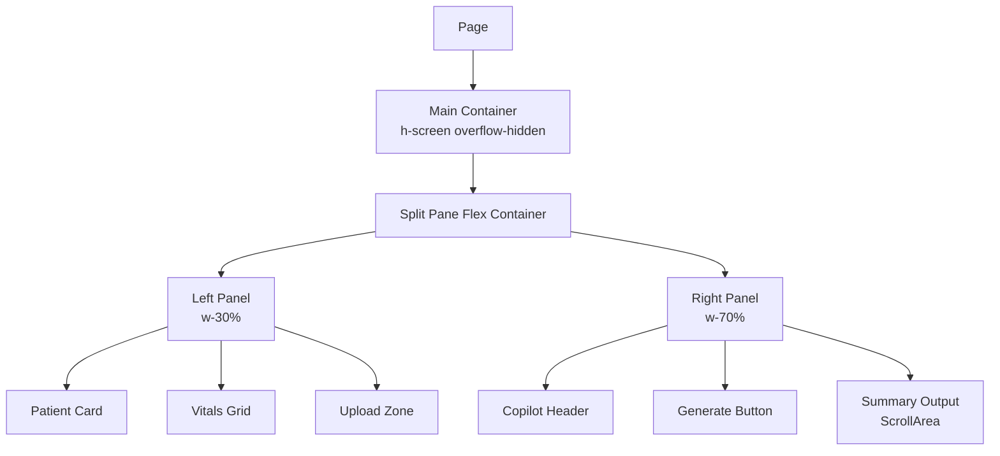

# MediSync Hospital Dashboard - UI Implementation Plan

## Overview

Transform the current MediSync dashboard into an enterprise-grade Hospital Dashboard with a professional medical theme using split-pane layout.

---

## Design Specifications

### Theme & Color Palette

| Element | Color | Usage |
|---------|-------|-------|
| Background | `slate-50` / `white` | Main backgrounds |
| Primary Accent | `teal-600` | Primary buttons, active states |
| Secondary Accent | `sky-600` | Links, secondary actions |
| Text Primary | `slate-900` | Headings, important text |
| Text Secondary | `slate-500` | Labels, descriptions |
| Borders | `slate-200` | Card borders, dividers |
| Success | `emerald-500` | Normal vitals, success states |
| Warning | `amber-500` | Elevated vitals, warnings |
| Danger | `rose-500` | Critical vitals, errors |

### Layout Structure

```
┌─────────────────────────────────────────────────────────────────┐
│  MediSync Header (from layout.tsx - keep existing)              │
├─────────────────────────────────────────────────────────────────┤
│  ┌─────────────────────┬───────────────────────────────────────┐│
│  │   LEFT PANEL        │          RIGHT PANEL                  ││
│  │   (30% width)       │          (70% width)                  ││
│  │                     │                                       ││
│  │  ┌───────────────┐  │  ┌─────────────────────────────────┐  ││
│  │  │ Patient Card  │  │  │  AI Copilot Header              │  ││
│  │  │ - Name        │  │  │  - Title + Description          │  ││
│  │  │ - Age         │  │  └─────────────────────────────────┘  ││
│  │  │ - Complaint   │  │                                       ││
│  │  │ - MRN         │  │  ┌─────────────────────────────────┐  ││
│  │  └───────────────┘  │  │  Generate Button ([SPARKLES])           │  ││
│  │                     │  └─────────────────────────────────┘  ││
│  │  ┌───────────────┐  │                                       ││
│  │  │ Vitals Grid   │  │  ┌─────────────────────────────────┐  ││
│  │  │ • HR          │  │  │                                 │  ││
│  │  │ • BP          │  │  │  Generated Summary Area          │  ││
│  │  │ • Temp        │  │  │  (ScrollArea component)         │  ││
│  │  │ • SpO2        │  │  │                                 │  ││
│  │  │ • Resp        │  │  │  - JSON/Markdown preview        │  ││
│  │  └───────────────┘  │  │  - Copy/Download actions        │  ││
│  │                     │  │                                 │  ││
│  │  ┌───────────────┐  │  └─────────────────────────────────┘  ││
│  │  │ Upload Zone   │  │                                       ││
│  │  │ (Drag & Drop) │  │                                       ││
│  │  └───────────────┘  │                                       ││
│  └─────────────────────┴───────────────────────────────────────┘│
└─────────────────────────────────────────────────────────────────┘
```

### Responsive Breakpoints

| Breakpoint | Width | Layout |
|------------|-------|--------|
| Desktop | ≥1024px | 30/70 split pane |
| Tablet | 768-1023px | 40/60 split pane |
| Mobile | <768px | Stacked single column |

---

## Implementation Tasks

### Task 1: Create Utility File
- [ ] **Create** `frontend/lib/utils.ts`
- [ ] **Implement** `cn()` function for className merging (clsx + tailwind-merge)

### Task 2: Create Dashboard Page
- [ ] **Replace** `frontend/app/page.tsx` with new Hospital Dashboard
- [ ] **Implement** split-pane layout with responsive design
- [ ] **Add** full-screen height (`h-screen`) with hidden overflow on main container

### Task 3: Build Patient Context Panel (Left - 30%)
- [ ] **Create** Patient Info Card component
  - Patient name: "John Doe"
  - Age: 65 years
  - MRN: "MRN-2024-001234"
  - Chief Complaint: "Chest Pain"
  - Admission Date: Current date
  - Attending Physician: "Dr. Sarah Chen"
- [ ] **Create** Vitals Grid component
  - Heart Rate: 78 bpm (normal - green)
  - Blood Pressure: 142/88 mmHg (elevated - amber)
  - Temperature: 98.6°F (normal - green)
  - SpO2: 97% (normal - green)
  - Respiratory Rate: 18/min (normal - green)
- [ ] **Create** Upload Medical Records zone
  - Dashed border design
  - UploadCloud icon from lucide-react
  - "Drag & drop medical records" text
  - "or click to browse" subtext

### Task 4: Build AI Copilot Panel (Right - 70%)
- [ ] **Create** Copilot Header section
  - Title: "AI Discharge Summary Copilot"
  - Description: "Generate clinical documentation from patient records"
- [ ] **Create** Generate Discharge Summary button
  - Primary variant with teal color
  - Sparkles icon ([SPARKLES]) for visual appeal
  - Loading state support
- [ ] **Create** Summary Output Area
  - Use ScrollArea from shadcn/ui
  - Placeholder text for generated content
  - Copy to clipboard button
  - Download as PDF/Markdown buttons

---

## Component Structure

```typescript
// Types needed for the dashboard
interface Patient {
  name: string
  age: number
  mrn: string
  chiefComplaint: string
  admissionDate: string
  attendingPhysician: string
}

interface Vital {
  label: string
  value: string
  unit: string
  status: 'normal' | 'elevated' | 'critical'
  icon: LucideIcon
}

interface Document {
  id: string
  name: string
  type: string
  uploadedAt: string
}
```

---

## Dummy Data

### Patient Information
```json
{
  "name": "John Doe",
  "age": 65,
  "mrn": "MRN-2024-001234",
  "chiefComplaint": "Chest Pain",
  "admissionDate": "2024-01-15",
  "attendingPhysician": "Dr. Sarah Chen"
}
```

### Vitals Data
```json
[
  { "label": "Heart Rate", "value": "78", "unit": "bpm", "status": "normal" },
  { "label": "Blood Pressure", "value": "142/88", "unit": "mmHg", "status": "elevated" },
  { "label": "Temperature", "value": "98.6", "unit": "°F", "status": "normal" },
  { "label": "SpO2", "value": "97", "unit": "%", "status": "normal" },
  { "label": "Respiratory Rate", "value": "18", "unit": "/min", "status": "normal" }
]
```

### Placeholder Summary Content
```markdown
## Discharge Summary

**Patient:** John Doe (MRN-2024-001234)  
**Admission Date:** January 15, 2024  
**Discharge Date:** [Pending]

### Chief Complaint
Chest pain, onset 3 days prior to admission...

[Generated content will appear here]
```

---

## Visual Design Details

### Card Styling
- Background: `bg-white`
- Border: `border-slate-200`
- Border Radius: `rounded-lg` or `rounded-xl`
- Shadow: `shadow-sm` (subtle)
- Padding: `p-4` or `p-6`

### Button Styling
- Primary: `bg-teal-600 hover:bg-teal-700 text-white`
- Size: `h-10 px-4` (default) or `h-11 px-6` (large)
- Border Radius: `rounded-md`

### Upload Zone Styling
- Border: `border-2 border-dashed border-slate-300`
- Background: `bg-slate-50`
- Hover: `border-teal-400 bg-teal-50`
- Padding: `p-8`
- Border Radius: `rounded-lg`

### Typography
- Headings: `text-lg font-semibold text-slate-900`
- Body: `text-sm text-slate-600`
- Labels: `text-xs font-medium text-slate-500 uppercase tracking-wide`

---

## Acceptance Criteria

1. [OK] Page displays with full screen height (`h-screen`)
2. [OK] Main content has `overflow-hidden` with scrollable internal panels
3. [OK] Left panel is exactly 30% width on desktop
4. [OK] Right panel takes remaining 70% width
5. [OK] Patient card shows all specified information
6. [OK] Vitals display with appropriate color coding
7. [OK] Upload zone has dashed border and upload icon
8. [OK] Generate button is prominent with sparkles icon
9. [OK] Summary area uses ScrollArea component
10. [OK] Layout collapses to single column on mobile (<768px)
11. [OK] Color scheme uses slate/zinc grays with teal/blue accents

---

## Files to Modify

| File | Action |
|------|--------|
| `frontend/lib/utils.ts` | Create (new file) |
| `frontend/app/page.tsx` | Replace entirely |
| `frontend/app/layout.tsx` | May need minor adjustments for h-screen |

---

## Mermaid: Component Hierarchy



---

## Next Steps

After this plan is approved, switch to **Code Mode** to implement:

1. Create the utility file
2. Build the complete dashboard page
3. Test responsive behavior
4. Verify all acceptance criteria
